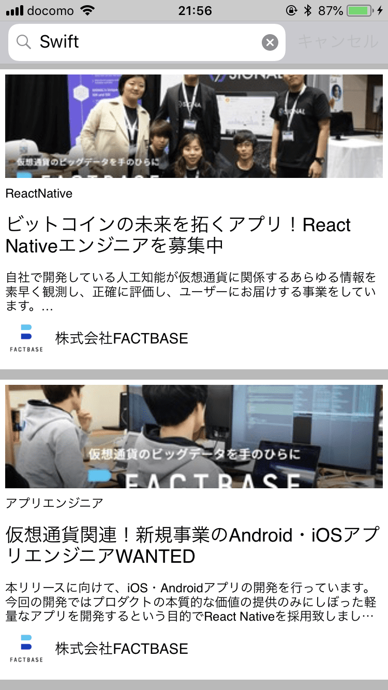
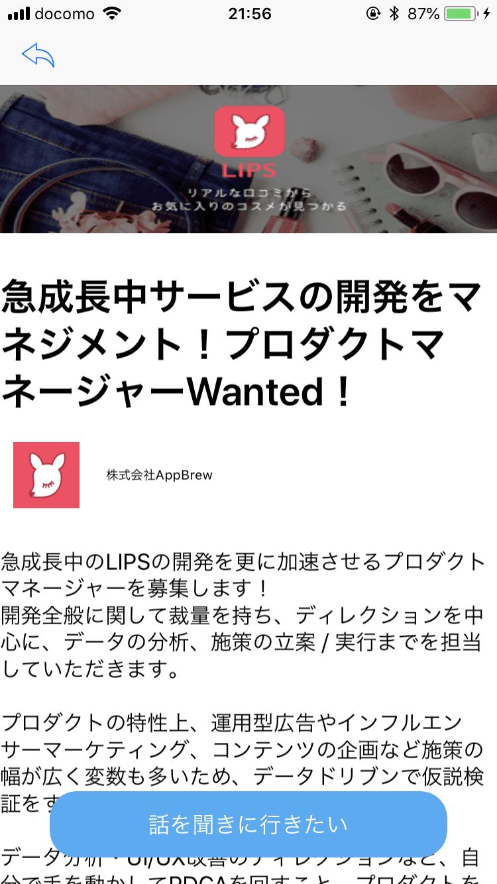
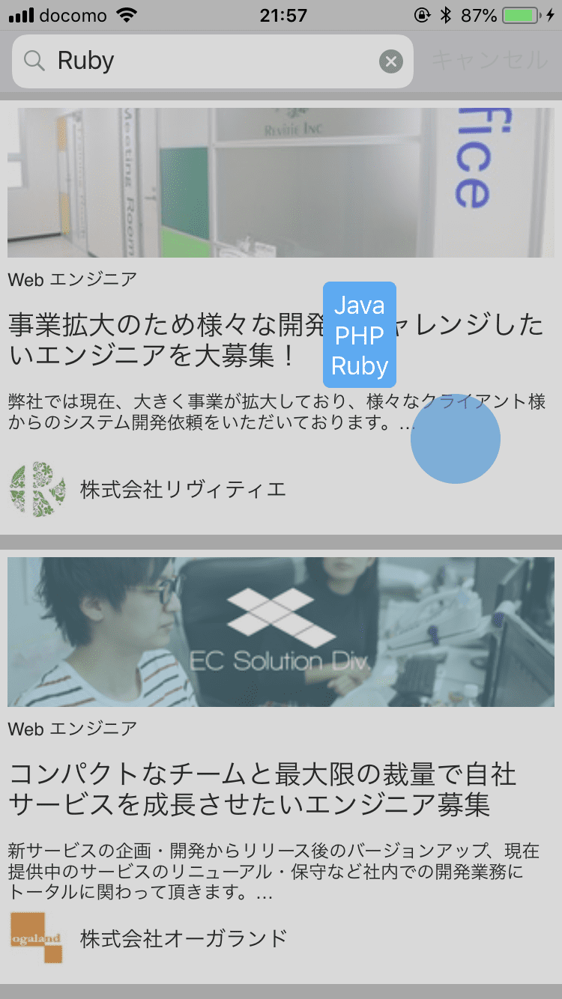

# app-wd-challenge

## スクリーンショット
|募集一覧|募集一覧|詳細画面|手軽なキーワード抽出|
|---|---|---|---|
|||||

## 盛り込んだ指定オプショナル項目
* 応募などのUIのインタラクション
* 募集一覧をタップした後の詳細画面
* ユーザーが募集の詳細画面を開きたくなる工夫

## 追加機能
* リスト状態で関連するキーワードをロングタップで表示
    - 詳細画面を開くよりも手軽な操作で確認可能
    - 詳細説明の文章から予め設定されたキーワード（現在は言語のみ）を抽出